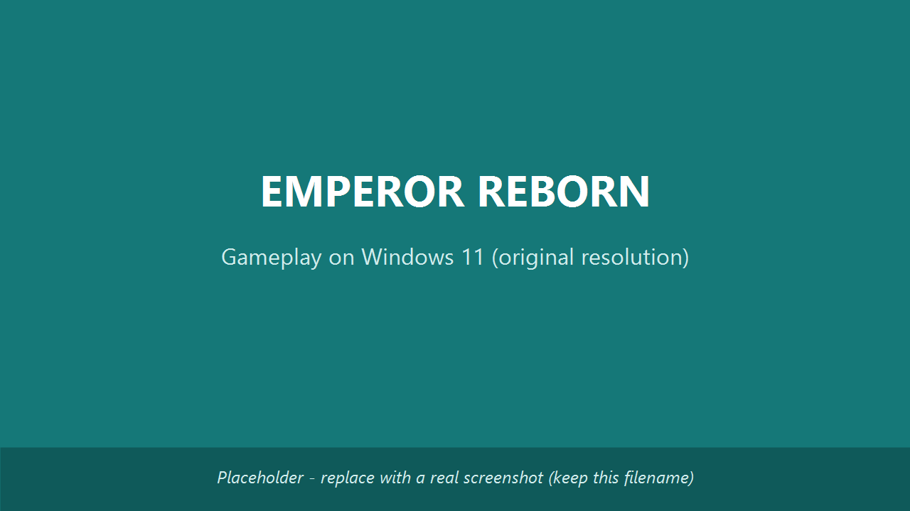
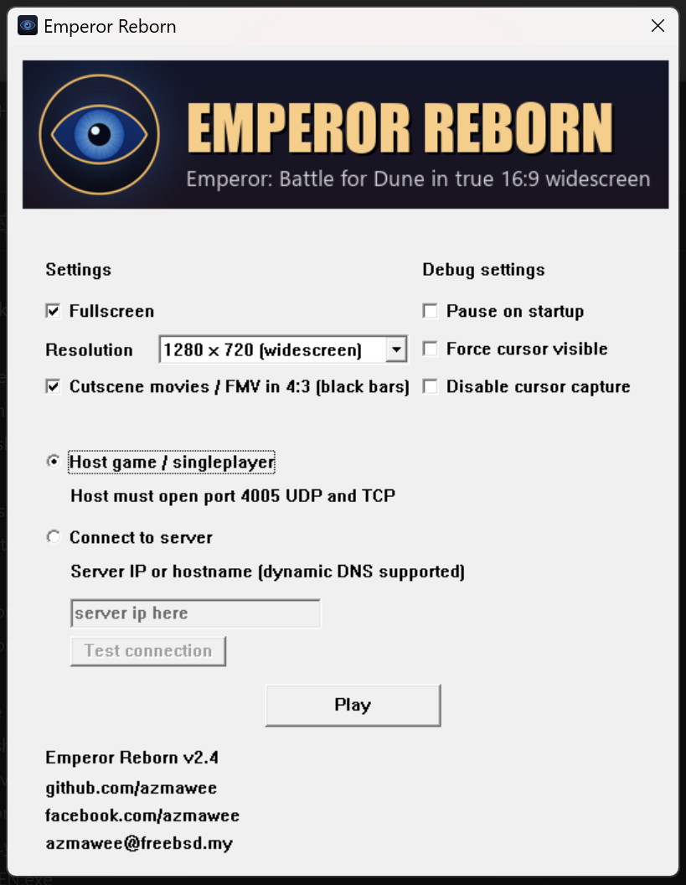

## Play *Emperor: Battle for Dune* on Windows 11 and modern PCs, as it was meant to be played

**Emperor Reborn** is a free, open-source launcher and patcher for the classic Westwood
real-time strategy game **_Emperor: Battle for Dune_ (2001)**. It makes the game install and
run smoothly on **Windows 10 and Windows 11**, at its **original resolutions**, looking and
playing exactly **as it was originally intended**, with **online multiplayer working again**.

[**Download the latest release**](https://github.com/azmawee/EmperorReborn/releases/latest)
&nbsp;|&nbsp;
[**Source code on GitHub**](https://github.com/azmawee/EmperorReborn)
&nbsp;|&nbsp;
[**Install guide**](https://github.com/azmawee/EmperorReborn/blob/main/INSTALL.txt)

---

## What it does

- Installs and runs *Emperor: Battle for Dune* cleanly on **modern Windows (10 and 11)**, with no
  compatibility hacks.
- Keeps the **original 4:3 resolutions and authentic look** (`640x480`, `800x600`, `1024x768`,
  `1152x864`, or Desktop), so the menus and fonts stay the right size.
- **Scales properly to fullscreen** so a low resolution fills your whole monitor instead of
  sitting in a tiny box on a 4K screen.
- **Restores online multiplayer** via direct IP connection, including Co-op Campaign.
- **Connect by hostname or dynamic DNS (DDNS)**, not just a raw IP, so a host with a changing
  home IP can share one stable name (for example a free `duckdns.org` address).
- **Self-contained**: no Visual C++ Redistributable required.

## System Requirements

| Requirement | Specification |
|---|---|
| Operating System | Windows 10 (1809 or later) or Windows 11 |
| Architecture | x64 (64-bit) |
| Original Game | Emperor: Battle for Dune (English): all 4 CDs, or 4 ISO images you can mount |
| Required Patch | EA v1.09 English patch `EM109EN.EXE`, placed in the same folder as `EmperorReborn.exe`. You supply your own; it was a free patch and is widely available online, so a quick web search for `EM109EN.EXE` will find it |
| Disk Space | ~2 GB for full game installation |
| Network | Optional, for online multiplayer (direct IP or DDNS) |
| Visual C++ Redistributable | Not required (self-contained) |

## Screenshots

*Emperor: Battle for Dune running at original resolution on Windows 11, properly scaled to fullscreen*

*The Emperor Reborn launcher with resolution and graphics options*

## Why people use it

If you have been searching for how to **play Emperor: Battle for Dune on Windows 11**, how to
**fix the resolution or tiny screen**, or how to get **multiplayer working again** on a modern PC,
Emperor Reborn is built for exactly that. The goal is preservation: play the original game the way
it ran in 2001, stable on today's hardware, not a remaster.

For online play, Emperor Reborn even lets the host be reached by a **hostname or dynamic DNS
(DDNS) name** instead of a raw IP, so friends can connect with one stable address even when the
host's home IP keeps changing.

## Get started

1. **Download** the latest release zip from the
   [releases page](https://github.com/azmawee/EmperorReborn/releases/latest).
2. Keep `EmperorReborn.exe` and `EmperorHooks.dll` together, and add your own copy of the official
   EA v1.09 patch `EM109EN.EXE` in the **same folder**.
3. **Have all 4 game discs ready**: insert the CDs, or mount the 4 ISO images.
4. Run `EmperorReborn.exe`. On first run it asks for each disc in turn (Disc 1 install, then
   Atreides, Harkonnen, Ordos) and builds its own clean copy of the game. Full steps are in the
   [install guide](https://github.com/azmawee/EmperorReborn/blob/main/INSTALL.txt).

You must own the **English** version of *Emperor: Battle for Dune*. No game data and no EA patch
are distributed here; you supply your own.

---

## Frequently Asked Questions

### Will Emperor: Battle for Dune work on Windows 11?

Yes. Emperor Reborn is built specifically to make *Emperor: Battle for Dune* run cleanly on Windows 10 and Windows 11 without compatibility hacks or virtual machines. The game launches, runs stable, and uses original resolutions properly scaled to modern displays.

### How do I fix the tiny resolution on a 4K monitor?

Emperor Reborn handles this automatically. Original resolutions (640x480, 800x600, 1024x768, 1152x864) are scaled to fill your entire monitor instead of appearing as a small box in the centre of a 4K screen. The aspect ratio and authentic look stay intact.

### Does Emperor Reborn restore online multiplayer?

Yes. Multiplayer works via direct IP connection, including Co-op Campaign mode. Emperor Reborn also supports connection by hostname or Dynamic DNS (DDNS) addresses (for example `yourname.duckdns.org`), so hosts with changing home IPs can share one stable name with friends.

### Do I need the original game CD or installation?

Yes. You must own the English version of *Emperor: Battle for Dune*. On first run the launcher asks you to insert or mount all 4 game discs (or their ISO images), one at a time, and builds its own clean install from them. Emperor Reborn does not distribute any game data, music, videos, or assets; you supply your own legally-owned discs.

### Where do I get the EA v1.09 patch (EM109EN.EXE)?

The official EA v1.09 English patch `EM109EN.EXE` is required but not distributed by Emperor Reborn. It was a free patch and is widely available online, so a quick web search for `EM109EN.EXE` will find it on game patch archives. Place it in the same folder as `EmperorReborn.exe` and `EmperorHooks.dll`.

### Is Emperor Reborn safe and legal to use?

Emperor Reborn is open-source software released under a permissive license. The source code is fully auditable on GitHub. It is an unofficial fan-made preservation tool, not affiliated with Electronic Arts or Westwood Studios. It does not redistribute any copyrighted game content.

### What is the difference between Emperor Reborn and a remaster?

Emperor Reborn is a preservation tool, not a remaster. The goal is to play the original 2001 game exactly as it was, just stable on modern hardware. No graphics overhaul, no AI rework, no gameplay changes. Just compatibility and online multiplayer restored.

### Will my old saves and campaigns work?

Yes. Emperor Reborn does not modify game data. Your saved games, campaign progress, and settings from the original game work as-is.

---

## Troubleshooting Common Issues

### Black screen on launch

If you see a black screen when launching the game, check that `EmperorHooks.dll` is in the same folder as `EmperorReborn.exe`. The launcher requires both files to be present. Also verify that the EA v1.09 patch (`EM109EN.EXE`) has been applied to your game installation.

### Mouse cursor stuck or invisible

This usually indicates a focus issue with fullscreen scaling. Alt-Tab out and back into the game once. If the issue persists, try launching at a lower resolution (640x480 or 800x600) through the Emperor Reborn launcher menu.

### Audio crackling or no sound

Modern Windows audio stack can conflict with the original game's audio engine. Try setting the game audio to Software mode in the in-game options. Updating your audio driver to the latest version from your motherboard or sound card vendor often resolves this.

### Multiplayer connection failed

For direct IP multiplayer, ensure the host has forwarded the required UDP ports on their router. For DDNS connections, verify the hostname resolves correctly by running `ping yourhost.duckdns.org` from Command Prompt before attempting to join.

### Game crashes during cutscenes

Cutscene crashes are usually caused by missing or corrupted video files in your game installation. Reinstall the original game from your CDs or installer, then reapply the EA v1.09 patch before running Emperor Reborn.

### Installer says "Windows protected your PC"

Windows SmartScreen flags unsigned executables from unknown publishers. Emperor Reborn is open-source and the source code is verifiable on GitHub. Click "More info" then "Run anyway" to proceed. You can also verify the SHA256 hash of the release zip against the checksum published in the GitHub release notes.

---

*Last updated: {{ site.time | date: "%B %Y" }} | Current version: [check releases](https://github.com/azmawee/EmperorReborn/releases/latest)*

---

*Emperor Reborn is an unofficial fan-made tool and is not affiliated with, endorsed by, or
supported by Electronic Arts or Westwood Studios. Emperor: Battle for Dune, Dune, Westwood Studios,
and all related trademarks are the property of their respective owners.*
